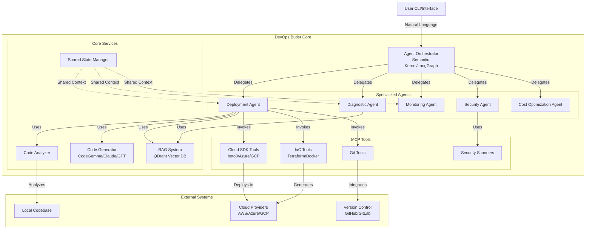
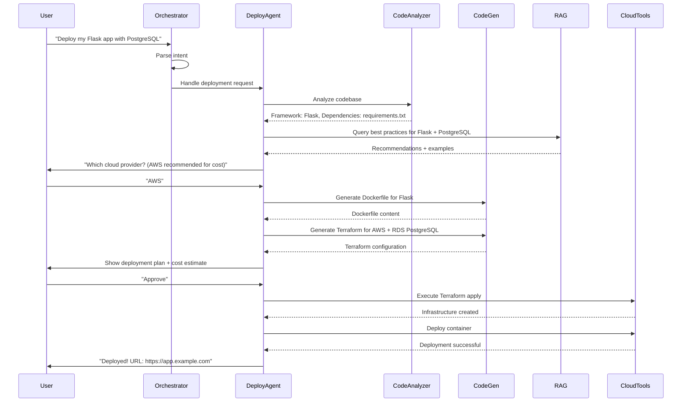

# Design Document: DevOps Butler

## Overview

DevOps Butler is an AI-powered conversational assistant that eliminates DevOps complexity for solo developers and small teams. The system uses a multi-agent architecture orchestrated by Semantic Kernel or LangGraph, with specialized agents handling deployment, diagnostics, monitoring, security, and cost optimization. A RAG system powered by QDrant provides context-aware recommendations based on DevOps best practices and user-specific infrastructure.

Architecturally, DevOps Butler implements a event-driven micro-agent mesh where each 
specialized agent operates within its own bounded context, communicating via a shared 
message bus with exactly-once delivery semantics. The agent registry maintains 
capability discovery using semantic embeddings, allowing dynamic routing of user 
intents to the most appropriate agent ensemble.

The system employs a hybrid inference strategy with tiered fallbacks:
- **Tier 1 (L0)**: Local code analysis using regex-based pattern matching and 
  language-specific parsers (PyPI metadata parsing, package.json traversal, 
  go.mod analysis) - zero latency, complete privacy
- **Tier 2 (L1)**: Quantized local LLM inference (CodeGemma-7B-Q4_K_M) via Ollama 
  for template generation - 50-100ms latency
- **Tier 3 (L2)**: Cloud LLM APIs with semantic caching (Redis) for complex 
  architectural decisions - 500-2000ms latency with cost optimization

The Knowledge Graph layer extends beyond simple RAG by implementing:
- **Temporal knowledge graphs** tracking infrastructure evolution over time
- **Cross-reference indexing** between cloud provider docs, Stack Overflow solutions, 
  and GitHub issue threads
- **Similarity search** using ColBERTv2 late interaction scoring for precision retrieval

For deployment orchestration, the system implements a state machine with 
checkpoint-restart capabilities, allowing partial rollbacks at any stage using 
Terraform's state management and Docker commit checkpoints. The execution engine 
supports both imperative (direct API calls) and declarative (IaC) workflows with 
automatic convergence detection.

Key architectural principles:
- **Privacy-first**: Code analysis happens locally; no source code sent to external servers
- **Hybrid AI**: Local models (CodeGemma) for offline work, cloud APIs (Claude/GPT) for complex reasoning
- **Multi-agent orchestration**: Specialized agents with domain expertise coordinated by a central orchestrator
- **Proactive help-seeking**: System asks for clarification rather than failing silently
- **MCP standardization**: Model Context Protocol for consistent tool invocation across agents

## Technology Stack

| Component | Technology | Justification |
|-----------|------------|---------------|
| Agent Orchestration | Semantic Kernel | Microsoft-backed, C#/.NET performance, strong multi-agent support |
| Vector Database | QDrant | Open-source, high performance, self-hostable |
| Local Code Generation | CodeGemma (Ollama) | 7B model runs on consumer hardware, privacy-focused |
| Cloud Code Generation | Claude Sonnet 3.7 | Complex reasoning, excellent at infrastructure code |
| MCP Framework | Model Context Protocol | Standardizing tool invocation across agents |
| Cloud SDKs | boto3, Azure SDK, Google Cloud SDK | Official provider SDKs |
| IaC Tools | Terraform/OpenTofu | Cloud-agnostic, industry standard |
| Container Runtime | Docker | Industry standard for containerization |
| CI/CD Integration | GitHub Actions, GitLab CI | Native integration with popular VCS platforms |
| Security Scanning | Trivy, Checkov | Open-source vulnerability and misconfiguration scanning |

## Architecture

### High-Level Architecture



### Agent Orchestration Flow



## Components and Interfaces

### 1. Agent Orchestrator

**Responsibility:** Coordinates specialized agents, maintains conversation context, routes user requests to appropriate agents.

**Technology:** Semantic Kernel (C#/.NET) or LangGraph (Python)

**Interface:**
```python
class AgentOrchestrator:
    def process_user_command(self, command: str, context: ConversationContext) -> Response:
        """
        Parse user command and delegate to appropriate agent(s).
        
        Args:
            command: Natural language command from user
            context: Current conversation and deployment context
            
        Returns:
            Response object with agent output and next actions
        """
        pass
    
    def delegate_to_agent(self, agent_type: AgentType, task: Task) -> AgentResult:
        """
        Delegate a specific task to a specialized agent.
        
        Args:
            agent_type: Type of agent (Deployment, Diagnostic, etc.)
            task: Task specification with parameters
            
        Returns:
            Result from the agent execution
        """
        pass
    
    def get_shared_state(self) -> SharedState:
        """Get current shared state accessible to all agents."""
        pass
    
    def update_shared_state(self, updates: Dict[str, Any]) -> None:
        """Update shared state with new information."""
        pass
```

**Key Behaviors:**
- Maintains conversation history and context across multiple turns
- Determines which agent(s) to invoke based on user intent
- Handles multi-step workflows requiring coordination between agents
- Implements retry logic and error handling for agent failures

### 2. Deployment Agent

**Responsibility:** Handles deployment requests, code analysis, infrastructure generation, and deployment execution.

**Interface:**
```python
class DeploymentAgent:
    def analyze_deployment_request(self, request: str, codebase_path: str) -> DeploymentSpec:
        """
        Analyze user request and codebase to create deployment specification.
        
        Args:
            request: User's deployment request
            codebase_path: Path to local codebase
            
        Returns:
            DeploymentSpec with detected framework, dependencies, requirements
        """
        pass
    
    def generate_infrastructure(self, spec: DeploymentSpec, cloud_provider: CloudProvider) -> InfrastructureConfig:
        """
        Generate Infrastructure as Code for the deployment.
        
        Args:
            spec: Deployment specification
            cloud_provider: Target cloud provider (AWS/Azure/GCP)
            
        Returns:
            InfrastructureConfig with Terraform, Dockerfiles, K8s manifests
        """
        pass
    
    def create_deployment_plan(self, config: InfrastructureConfig) -> DeploymentPlan:
        """
        Create human-readable deployment plan with cost estimates.
        
        Args:
            config: Generated infrastructure configuration
            
        Returns:
            DeploymentPlan with steps, costs, security considerations
        """
        pass
    
    def execute_deployment(self, plan: DeploymentPlan, approved: bool) -> DeploymentResult:
        """
        Execute the deployment if approved by user.
        
        Args:
            plan: Deployment plan to execute
            approved: User approval status
            
        Returns:
            DeploymentResult with status, URLs, connection info
        """
        pass
```

### 3. Diagnostic Agent

**Responsibility:** Analyzes failures, suggests fixes, implements automated remediation.

**Interface:**
```python
class DiagnosticAgent:
    def analyze_failure(self, error_logs: List[str], deployment_context: DeploymentContext) -> Diagnosis:
        """
        Analyze deployment or runtime failure to identify root cause.
        
        Args:
            error_logs: Error messages and logs from failure
            deployment_context: Context about the deployment
            
        Returns:
            Diagnosis with root cause, confidence level, suggested fixes
        """
        pass
    
    def suggest_remediation(self, diagnosis: Diagnosis) -> List[RemediationStep]:
        """
        Suggest specific remediation steps in plain English.
        
        Args:
            diagnosis: Diagnosis from analyze_failure
            
        Returns:
            List of remediation steps ordered by likelihood of success
        """
        pass
    
    def can_auto_fix(self, diagnosis: Diagnosis) -> bool:
        """
        Determine if the issue can be fixed automatically.
        
        Args:
            diagnosis: Diagnosis from analyze_failure
            
        Returns:
            True if auto-fix is possible and safe
        """
        pass
    
    def execute_auto_fix(self, diagnosis: Diagnosis, approved: bool) -> FixResult:
        """
        Execute automated fix if approved by user.
        
        Args:
            diagnosis: Diagnosis with identified issue
            approved: User approval for auto-fix
            
        Returns:
            FixResult with success status and verification
        """
        pass
```

### 4. Code Analyzer

**Responsibility:** Analyzes local codebase to detect framework, dependencies, entry points, and configuration needs.

**Interface:**
```python
class CodeAnalyzer:
    def detect_framework(self, codebase_path: str) -> FrameworkInfo:
        """
        Detect application framework and language.
        
        Args:
            codebase_path: Path to local codebase
            
        Returns:
            FrameworkInfo with language, framework, version
        """
        pass
    
    def extract_dependencies(self, codebase_path: str) -> Dependencies:
        """
        Extract dependencies from package files (requirements.txt, package.json, etc.).
        
        Args:
            codebase_path: Path to local codebase
            
        Returns:
            Dependencies with packages, versions, system requirements
        """
        pass
    
    def find_entry_points(self, codebase_path: str, framework: FrameworkInfo) -> List[EntryPoint]:
        """
        Find application entry points (main files, server start commands).
        
        Args:
            codebase_path: Path to local codebase
            framework: Detected framework information
            
        Returns:
            List of entry points with file paths and start commands
        """
        pass
    
    def detect_environment_variables(self, codebase_path: str) -> List[EnvVar]:
        """
        Detect environment variables used in the code.
        
        Args:
            codebase_path: Path to local codebase
            
        Returns:
            List of environment variables with names and whether they're required
        """
        pass
    
    def check_for_tests(self, codebase_path: str) -> TestInfo:
        """
        Check if automated tests exist and how to run them.
        
        Args:
            codebase_path: Path to local codebase
            
        Returns:
            TestInfo with test framework, test command, coverage info
        """
        pass
```

### 5. Code Generator

**Responsibility:** Generates Infrastructure as Code using local models (CodeGemma) or cloud APIs (Claude/GPT).

**Interface:**
```python
class CodeGenerator:
    def generate_dockerfile(self, spec: DeploymentSpec, framework: FrameworkInfo) -> str:
        """
        Generate optimized Dockerfile for the application.
        
        Args:
            spec: Deployment specification
            framework: Detected framework information
            
        Returns:
            Dockerfile content as string with comments
        """
        pass
    
    def generate_terraform(self, spec: DeploymentSpec, cloud_provider: CloudProvider) -> Dict[str, str]:
        """
        Generate Terraform configuration files.
        
        Args:
            spec: Deployment specification
            cloud_provider: Target cloud provider
            
        Returns:
            Dictionary mapping filename to Terraform content
        """
        pass
    
    def generate_kubernetes_manifests(self, spec: DeploymentSpec) -> Dict[str, str]:
        """
        Generate Kubernetes manifests (deployment, service, ingress).
        
        Args:
            spec: Deployment specification
            
        Returns:
            Dictionary mapping filename to K8s manifest content
        """
        pass
    
    def generate_cicd_pipeline(self, spec: DeploymentSpec, vcs_provider: str) -> str:
        """
        Generate CI/CD pipeline configuration (GitHub Actions, GitLab CI).
        
        Args:
            spec: Deployment specification
            vcs_provider: Version control provider (github, gitlab)
            
        Returns:
            CI/CD pipeline configuration as string
        """
        pass
    
    def use_local_model(self) -> bool:
        """Check if local model (CodeGemma) is available for offline generation."""
        pass
```

**Model Selection Strategy:**
- Use CodeGemma (local) when available for privacy and offline capability
- Fall back to Claude/GPT APIs for complex generation tasks
- Never send sensitive data (secrets, credentials) to external APIs
- Cache generated templates in RAG system for faster future generation

### 6. RAG System (Knowledge Base)

**Responsibility:** Stores and retrieves DevOps knowledge, best practices, and user-specific context.

**Technology:** QDrant vector database with embeddings

**Interface:**
```python
class RAGSystem:
    def query_knowledge(self, query: str, context: Dict[str, Any]) -> List[KnowledgeItem]:
        """
        Query knowledge base for relevant information.
        
        Args:
            query: Natural language query
            context: Additional context (cloud provider, framework, etc.)
            
        Returns:
            List of relevant knowledge items with similarity scores
        """
        pass
    
    def embed_codebase(self, codebase_path: str, deployment_id: str) -> None:
        """
        Embed user's codebase into vector database for context-aware assistance.
        
        Args:
            codebase_path: Path to local codebase
            deployment_id: Unique identifier for this deployment
        """
        pass
    
    def store_successful_pattern(self, pattern: DeploymentPattern) -> None:
        """
        Store successful deployment pattern for future reference.
        
        Args:
            pattern: Deployment pattern with configuration and outcomes
        """
        pass
    
    def get_troubleshooting_guide(self, error_type: str, context: Dict[str, Any]) -> Optional[TroubleshootingGuide]:
        """
        Retrieve troubleshooting guide for specific error type.
        
        Args:
            error_type: Type of error encountered
            context: Deployment context
            
        Returns:
            TroubleshootingGuide if found, None otherwise
        """
        pass
```

**Knowledge Base Contents:**
- DevOps best practices (security, performance, cost optimization)
- Cloud provider documentation and examples
- Common error patterns and solutions
- Framework-specific deployment guides
- User's historical deployments and configurations

### 7. MCP Tools

**Responsibility:** Standardized tools for cloud operations, IaC execution, Git operations, and security scanning.

**MCP Tool Categories:**

**Cloud SDK Tools:**
```python
class CloudSDKTool(MCPTool):
    """MCP tool for cloud provider operations."""
    
    def execute_terraform(self, config_path: str, action: str) -> TerraformResult:
        """Execute Terraform command (plan, apply, destroy)."""
        pass
    
    def deploy_container(self, image: str, config: ContainerConfig) -> DeploymentResult:
        """Deploy container to cloud provider."""
        pass
    
    def provision_database(self, db_config: DatabaseConfig) -> DatabaseInstance:
        """Provision managed database service."""
        pass
```

**IaC Tools:**
```python
class IaCTool(MCPTool):
    """MCP tool for Infrastructure as Code operations."""
    
    def validate_terraform(self, config_path: str) -> ValidationResult:
        """Validate Terraform configuration syntax."""
        pass
    
    def build_docker_image(self, dockerfile_path: str, tag: str) -> BuildResult:
        """Build Docker image from Dockerfile."""
        pass
    
    def push_docker_image(self, image: str, registry: str) -> PushResult:
        """Push Docker image to container registry."""
        pass
```

**Security Tools:**
```python
class SecurityTool(MCPTool):
    """MCP tool for security scanning."""
    
    def scan_container_image(self, image: str) -> List[Vulnerability]:
        """Scan container image for vulnerabilities."""
        pass
    
    def scan_iac_config(self, config_path: str) -> List[SecurityIssue]:
        """Scan IaC configuration for security misconfigurations."""
        pass
    
    def scan_dependencies(self, dependencies: Dependencies) -> List[Vulnerability]:
        """Scan application dependencies for known vulnerabilities."""
        pass
```

## Data Models

### DeploymentSpec

```python
@dataclass
class DeploymentSpec:
    """Specification for a deployment request."""
    
    deployment_id: str
    user_request: str
    codebase_path: str
    framework: FrameworkInfo
    dependencies: Dependencies
    environment_variables: List[EnvVar]
    services: List[ServiceRequirement]  # databases, caches, queues
    cloud_provider: Optional[CloudProvider]
    environment: DeploymentEnvironment  # dev, staging, production
    scaling_requirements: Optional[ScalingRequirements]
    created_at: datetime
```

### FrameworkInfo

```python
@dataclass
class FrameworkInfo:
    """Information about detected application framework."""
    
    language: str  # python, javascript, java, go
    framework: str  # flask, django, express, spring-boot
    version: Optional[str]
    entry_point: str  # main file or start command
    port: int  # default application port
```

### InfrastructureConfig

```python
@dataclass
class InfrastructureConfig:
    """Generated Infrastructure as Code configuration."""
    
    dockerfile: str
    terraform_files: Dict[str, str]  # filename -> content
    kubernetes_manifests: Optional[Dict[str, str]]
    cicd_pipeline: Optional[str]
    docker_compose: Optional[str]
    comments: Dict[str, str]  # explanations for each component
    generated_at: datetime
```

### DeploymentPlan

```python
@dataclass
class DeploymentPlan:
    """Human-readable deployment plan."""
    
    summary: str  # plain English summary
    steps: List[DeploymentStep]
    infrastructure_components: List[InfrastructureComponent]
    estimated_monthly_cost: float
    security_considerations: List[str]
    requires_approval: bool
```

### DeploymentStep

```python
@dataclass
class DeploymentStep:
    """Individual step in deployment process."""
    
    step_number: int
    description: str  # plain English description
    command: Optional[str]  # actual command to execute
    estimated_duration: int  # seconds
    can_rollback: bool
```

### Diagnosis

```python
@dataclass
class Diagnosis:
    """Diagnosis of a deployment or runtime failure."""
    
    error_type: str
    root_cause: str  # plain English explanation
    confidence: float  # 0.0 to 1.0
    affected_components: List[str]
    suggested_fixes: List[RemediationStep]
    can_auto_fix: bool
    knowledge_source: str  # where diagnosis came from (RAG, heuristics, etc.)
```

### RemediationStep

```python
@dataclass
class RemediationStep:
    """Step to remediate an issue."""
    
    description: str  # plain English description
    action: str  # specific action to take
    requires_user_input: bool
    estimated_success_rate: float
    risk_level: str  # low, medium, high
```

### ConversationContext

```python
@dataclass
class ConversationContext:
    """Context maintained across conversation turns."""
    
    session_id: str
    user_id: str
    conversation_history: List[Message]
    current_deployment: Optional[DeploymentSpec]
    pending_questions: List[Question]
    shared_state: Dict[str, Any]
```

### ServiceRequirement

```python
@dataclass
class ServiceRequirement:
    """Requirement for an additional service (database, cache, etc.)."""
    
    service_type: str  # postgresql, redis, rabbitmq, etc.
    version: Optional[str]
    size: str  # small, medium, large
    backup_enabled: bool
    high_availability: bool
```

### CloudProvider

```python
class CloudProvider(Enum):
    """Supported cloud providers."""
    AWS = "aws"
    AZURE = "azure"
    GCP = "gcp"
```

### DeploymentEnvironment

```python
class DeploymentEnvironment(Enum):
    """Deployment environment types."""
    DEVELOPMENT = "development"
    STAGING = "staging"
    PRODUCTION = "production"
```

## Scalability Considerations

### Agent Horizontal Scaling

The Agent Orchestrator can be scaled horizontally to handle multiple concurrent users:

- **Multiple Orchestrator Instances**: Deploy multiple instances of the orchestrator behind a load balancer
- **Shared State with Redis**: Use Redis as a distributed cache for conversation context and shared state
- **Stateless Agent Design**: Specialized agents are stateless and can be scaled independently
- **Job Queue for Long Operations**: Use a job queue (RabbitMQ, AWS SQS) for long-running deployments

### Knowledge Base Sharding

The QDrant vector database can be partitioned for better performance:

- **Partition by User/Project**: Each user or project gets its own collection in QDrant
- **Parallel Queries**: Multiple queries can be processed in parallel across partitions
- **Incremental Indexing**: New deployments are indexed incrementally without blocking queries
- **Replication**: QDrant supports replication for high availability

### Code Generation Caching

Generated code templates are cached to improve response time:

- **Template Cache**: Common patterns (Flask + PostgreSQL, Express + MongoDB) are cached
- **Cache Invalidation**: Cache is invalidated when best practices are updated
- **User-Specific Cache**: User's historical deployments are cached for faster regeneration
- **Distributed Cache**: Redis stores cached templates accessible to all orchestrator instances

### Async Processing

Long-running operations are handled asynchronously:

- **Job Queue**: Deployments, security scans, and builds are queued
- **Progress Updates**: WebSocket or polling for real-time progress updates
- **Timeout Handling**: Long operations have configurable timeouts with automatic retry
- **Parallel Execution**: Independent deployment steps (e.g., multiple services) run in parallel

### Performance Targets

- **Command Parsing**: < 500ms for 95th percentile
- **Code Generation**: < 5 seconds for typical application
- **Deployment Execution**: < 10 minutes for simple deployments
- **Failure Diagnosis**: < 30 seconds for common errors
- **Concurrent Users**: Support 100+ concurrent users per orchestrator instance

## Security Architecture

### Credential Storage

All credentials and secrets are stored securely:

- **HashiCorp Vault Integration**: Dynamic secrets with automatic rotation
- **Cloud Secret Services**: AWS Secrets Manager, Azure Key Vault, Google Secret Manager
- **Encryption at Rest**: All stored credentials encrypted with AES-256
- **Encryption in Transit**: TLS 1.3 for all network communication
- **No Plain Text**: Credentials never logged or stored in plain text

### IAM Least Privilege

Every operation uses minimal required permissions:

- **Scoped Credentials**: Each deployment gets temporary credentials with minimal scope
- **Role-Based Access**: Users assigned roles (developer, admin) with appropriate permissions
- **Service Accounts**: Each agent uses a dedicated service account with limited permissions
- **Permission Auditing**: Regular audits of IAM policies to remove unused permissions
- **Just-In-Time Access**: Elevated permissions granted only when needed and automatically revoked

### Audit Logging

All actions are logged for security and compliance:

- **Comprehensive Logging**: User, timestamp, action, resource, outcome logged for every operation
- **Immutable Logs**: Logs stored in append-only storage (AWS CloudWatch, Azure Monitor)
- **Log Retention**: Configurable retention period (default 90 days)
- **Anomaly Detection**: ML-based detection of unusual access patterns
- **Compliance Reports**: Automated generation of compliance reports (SOC 2, ISO 27001)

### Data Isolation

User data is strictly isolated:

- **Multi-Tenancy**: Each user's data stored in isolated namespaces
- **No Cross-Tenant Access**: Agents cannot access data from other users
- **Network Isolation**: Deployed applications use VPCs with strict security groups
- **Database Isolation**: Each user's deployments use separate database instances or schemas

### Secure Defaults

All generated code follows security best practices:

- **Non-Root Containers**: All Dockerfiles use non-root users
- **Minimal Base Images**: Use slim/alpine images to reduce attack surface
- **HTTPS Everywhere**: All public endpoints configured with TLS
- **Security Headers**: Generated web servers include security headers (CSP, HSTS, X-Frame-Options)
- **Input Validation**: Generated code includes input validation and sanitization
- **Dependency Scanning**: All dependencies scanned for known vulnerabilities before deployment

### Vulnerability Management

Continuous security monitoring and remediation:

- **Automated Scanning**: Container images and dependencies scanned on every build
- **Vulnerability Database**: CVE database updated daily
- **Severity Classification**: Vulnerabilities classified as critical, high, medium, low
- **Automated Patching**: Critical vulnerabilities trigger automatic patch generation
- **Security Notifications**: Users notified of vulnerabilities in their deployments

### Compliance Support

Built-in support for common compliance frameworks:

- **GDPR**: Data residency controls, right to deletion, data portability
- **HIPAA**: Encryption, access controls, audit logging, BAA support
- **SOC 2**: Security controls, availability monitoring, confidentiality
- **PCI DSS**: Network segmentation, encryption, access controls
- **Compliance Templates**: Pre-configured templates for compliant deployments

## Correctness Properties

*A property is a characteristic or behavior that should hold true across all valid executions of a system—essentially, a formal statement about what the system should do. Properties serve as the bridge between human-readable specifications and machine-verifiable correctness guarantees.*

### Property 1: Conversational Command Parsing

*For any* conversational deployment command, the system should parse it to extract structured information (application type, dependencies, infrastructure needs) that can be used to generate a deployment specification.

**Validates: Requirements 1.1**

### Property 2: Graceful Handling of Ambiguity

*For any* ambiguous or incomplete command, the system should ask specific clarifying questions rather than failing or making incorrect assumptions.

**Validates: Requirements 1.2, 14.4**

### Property 3: Conversation Context Preservation

*For any* sequence of conversation turns within a single deployment session, information provided in earlier turns should be accessible and used in later turns without requiring the user to repeat themselves.

**Validates: Requirements 1.6**

### Property 4: Infrastructure as Code Generation Completeness

*For any* valid deployment specification, the system should generate all necessary Infrastructure as Code files (Terraform, Dockerfile, and optionally Kubernetes manifests or CI/CD pipelines) required for deployment.

**Validates: Requirements 2.1, 2.2, 2.6**

### Property 5: Conditional Complexity Selection

*For any* deployment specification, the system should choose simpler deployment methods (Docker Compose, single-container) when scale requirements are low, and more complex methods (Kubernetes) only when scale requirements justify the complexity.

**Validates: Requirements 2.3, 2.4**

### Property 6: Security Best Practices in Generated Code

*For any* generated Infrastructure as Code, the configuration should follow security best practices including: non-root users in containers, minimal base images, no plain-text secrets, HTTPS/TLS for public endpoints, and least-privilege IAM roles.

**Validates: Requirements 2.5, 10.3, 20.4, 20.5**

### Property 7: Codebase Analysis Accuracy

*For any* supported codebase (Python, JavaScript/TypeScript, Java, Go), the system should correctly detect the framework, dependencies, entry points, and required environment variables.

**Validates: Requirements 2.7, 18.1**

### Property 8: Deployment Plan Generation

*For any* generated Infrastructure configuration, the system should create a deployment plan that includes: plain English descriptions, estimated costs, security considerations, and deployment steps.

**Validates: Requirements 3.1, 3.2, 3.3, 3.4**

### Property 9: Cloud Provider Recommendation

*For any* deployment specification without a specified cloud provider, the system should recommend a provider based on application requirements and cost, with justification for the recommendation.

**Validates: Requirements 4.2**

### Property 10: Terraform for Cloud Agnosticism

*For any* generated infrastructure configuration, cloud resources should be defined using Terraform to enable cloud provider portability.

**Validates: Requirements 4.3**

### Property 11: Cloud Provider Switching

*For any* existing deployment, switching the cloud provider should regenerate valid Terraform configurations for the new provider while preserving application functionality.

**Validates: Requirements 4.6**

### Property 12: Deployment Step Ordering

*For any* approved deployment plan, execution should proceed in the correct order (infrastructure before application, dependencies before dependents) to avoid failures due to missing prerequisites.

**Validates: Requirements 5.1**

### Property 13: Deployment Failure Handling

*For any* deployment step failure, the system should provide a clear error message and suggest specific remediation steps rather than generic error output.

**Validates: Requirements 5.3**

### Property 14: Successful Deployment Output

*For any* successfully completed deployment, the system should provide access URLs, connection information, and any credentials needed to use the deployed application.

**Validates: Requirements 5.4**

### Property 15: Pre-Deployment Validation

*For any* deployment attempt, the system should validate cloud credentials and perform syntax/configuration checks before executing any infrastructure changes.

**Validates: Requirements 5.5, 5.6**

### Property 16: Environment Isolation

*For any* two different deployment environments (dev, staging, production), changes to one environment should not affect the infrastructure or configuration of the other environment.

**Validates: Requirements 6.3**

### Property 17: Environment-Specific Configuration

*For any* new deployment environment, the system should generate configurations appropriate for that environment type (e.g., smaller instances for dev, high availability for production).

**Validates: Requirements 6.2**

### Property 18: Environment Promotion

*For any* deployment in a source environment, promoting it to a target environment should deploy the same application version with environment-appropriate configuration adjustments.

**Validates: Requirements 6.5**

### Property 19: Service Provisioning with Security

*For any* service provisioning request (database, cache, message queue, storage), the system should provision the service, configure automated backups (where applicable), generate secure credentials, store them as secrets, and configure access controls to restrict connections to application services only.

**Validates: Requirements 7.1, 7.3, 7.4, 7.6, 15.1, 15.3**

### Property 20: Service-to-Service Networking

*For any* deployment with multiple services, the system should configure networking and security groups to allow required service-to-service communication while blocking unauthorized access.

**Validates: Requirements 15.5**

### Property 21: Monitoring and Health Check Configuration

*For any* deployed application, the system should configure logging, health checks, and basic metrics (CPU, memory, request count, error rate) automatically.

**Validates: Requirements 8.1, 8.3, 8.5**

### Property 22: Unhealthy Application Notification

*For any* deployed application that becomes unhealthy, the system should detect the unhealthy state and send a notification to the user.

**Validates: Requirements 8.4**

### Property 23: Cost Estimation and Warnings

*For any* deployment plan, the system should estimate monthly costs and warn the user if costs exceed configured thresholds.

**Validates: Requirements 9.1, 9.2**

### Property 24: Cost Optimization Recommendations

*For any* deployment, the system should recommend cost optimizations (smaller instances, reserved instances, spot instances, free tiers) when applicable.

**Validates: Requirements 9.3, 9.5**

### Property 25: Secret Management Round-Trip

*For any* secret added by the user, the secret should be encrypted before storage, stored using cloud secret management services in generated infrastructure, and injected into the application as environment variables at runtime, with the original secret value never appearing in plain text in any configuration file or version control.

**Validates: Requirements 10.1, 10.2, 10.4, 10.5**

### Property 26: Deployment History and Rollback

*For any* deployment environment, the system should maintain a history of previous deployments, allow rolling back to any previous version, restore both application code and infrastructure configuration during rollback, and verify the previous version is running correctly after rollback completes.

**Validates: Requirements 11.1, 11.2, 11.3, 11.5**

### Property 27: Generated Code Documentation

*For any* generated Infrastructure as Code, the files should include comments explaining what each section does, and decisions made by the system should include explanations of the reasoning.

**Validates: Requirements 12.1, 12.4**

### Property 28: Documentation Links

*For any* DevOps concept or technology used in the deployment, the system should provide links to relevant documentation for users who want to learn more.

**Validates: Requirements 12.5**

### Property 29: Performance Optimization Analysis

*For any* user request for performance improvements, the system should analyze current performance metrics, suggest specific optimizations, and explain the expected impact before applying changes.

**Validates: Requirements 13.1, 13.6**

### Property 30: Scaling Decision Logic

*For any* scaling request, the system should determine whether vertical scaling (larger instances) or horizontal scaling (more instances) is more appropriate based on the application characteristics and current resource utilization.

**Validates: Requirements 13.3**

### Property 31: Auto-Scaling Configuration

*For any* deployment that would benefit from auto-scaling, the system should configure auto-scaling policies based on appropriate thresholds (CPU, memory, or request rate).

**Validates: Requirements 13.4**

### Property 32: Optimization Workflow

*For any* approved optimization, the system should update the Infrastructure configuration and trigger redeployment automatically.

**Validates: Requirements 13.5**

### Property 33: Failure Diagnosis and Remediation

*For any* deployment or runtime failure, the Diagnostic Agent should analyze error logs, identify the root cause, and suggest specific remediation steps in plain English.

**Validates: Requirements 14.1, 14.2**

### Property 34: Automated Fix Workflow

*For any* issue that can be fixed automatically (e.g., increase memory limits, restart services), the system should ask for user permission before executing the fix.

**Validates: Requirements 14.3**

### Property 35: Automatic Container Restart Configuration

*For any* containerized deployment, the system should configure automatic restart policies for crashed containers.

**Validates: Requirements 14.5**

### Property 36: Repeated Failure Pattern Analysis

*For any* application that becomes unhealthy repeatedly, the system should analyze the pattern of failures and suggest architectural changes to address the root cause.

**Validates: Requirements 14.6**

### Property 37: Knowledge Base Integration for Troubleshooting

*For any* error encountered during deployment or runtime, the system should query the Knowledge Base for relevant troubleshooting information and incorporate it into the diagnosis.

**Validates: Requirements 14.7**

### Property 38: Infrastructure Update for Service Addition

*For any* service addition request, the system should update the Infrastructure configuration to include the new service and provide connection examples in the application's programming language.

**Validates: Requirements 15.4, 15.6**

### Property 39: Multi-Agent Delegation

*For any* user request requiring multiple capabilities (e.g., deployment + security scanning + cost optimization), the Agent Orchestrator should delegate tasks to the appropriate specialized agents.

**Validates: Requirements 16.3**

### Property 40: Shared State Accessibility

*For any* agent needing context from another agent's work, the shared state should be accessible and contain the necessary information.

**Validates: Requirements 16.5**

### Property 41: Inter-Agent Help Requests

*For any* agent encountering a task outside its domain expertise, the agent should be able to request help from other specialized agents.

**Validates: Requirements 16.6**

### Property 42: Knowledge Base Query for Recommendations

*For any* recommendation or decision made by the system, the Knowledge Base should be queried for relevant DevOps best practices and cloud provider documentation.

**Validates: Requirements 17.3**

### Property 43: Codebase Embedding for Context

*For any* user codebase, the code and infrastructure configurations should be embedded into the Knowledge Base to enable context-aware assistance.

**Validates: Requirements 17.4**

### Property 44: Uncertainty Indication

*For any* query where the Knowledge Base lacks sufficient information, the system should indicate uncertainty and suggest consulting external documentation rather than providing potentially incorrect information.

**Validates: Requirements 17.5**

### Property 45: Learning from Success

*For any* successful deployment, the deployment pattern and configuration should be stored in the Knowledge Base for future reference.

**Validates: Requirements 17.6**

### Property 46: Base Image Selection

*For any* Dockerfile generation, the system should select an appropriate base image based on the detected language and framework (e.g., python:3.11-slim for Python, node:18-alpine for Node.js).

**Validates: Requirements 18.3**

### Property 47: Environment Variable Detection and Prompting

*For any* application using environment variables, the system should detect which variables are needed and prompt the user for values.

**Validates: Requirements 18.4**

### Property 48: Health Check Generation

*For any* application without existing health check endpoints, the system should generate appropriate health check endpoints.

**Validates: Requirements 18.5**

### Property 49: Conditional Test Integration

*For any* CI/CD pipeline generation, if automated tests are detected in the codebase, the pipeline should include steps to run those tests before deployment.

**Validates: Requirements 18.6**

### Property 50: CI/CD Trigger Configuration

*For any* generated CI/CD pipeline, the pipeline should be configured to trigger automatically on code commits.

**Validates: Requirements 19.1**

### Property 51: Automatic Build on Push

*For any* code push to a repository with configured CI/CD, the system should automatically build container images.

**Validates: Requirements 19.2**

### Property 52: Test-Before-Deploy

*For any* CI/CD pipeline execution, automated tests should run before deployment, and deployment should only proceed if tests pass.

**Validates: Requirements 19.3**

### Property 53: Automatic Staging Deployment

*For any* CI/CD pipeline where tests pass, deployment to the staging environment should happen automatically.

**Validates: Requirements 19.4**

### Property 54: Production Deployment Workflow

*For any* production deployment, the system should follow the user's configured workflow (manual approval or automated promotion after staging verification).

**Validates: Requirements 19.5**

### Property 55: CI/CD Failure Analysis

*For any* CI/CD pipeline failure, the Diagnostic Agent should analyze the failure and notify the user with specific information about what went wrong.

**Validates: Requirements 19.7**

### Property 56: Pre-Deployment Security Scanning

*For any* deployment, the system should scan container images for vulnerabilities and scan Infrastructure configuration for security misconfigurations before deployment proceeds.

**Validates: Requirements 20.1, 20.2**

### Property 57: Security Issue Remediation Workflow

*For any* detected security issue, the system should provide specific remediation steps and ask for user permission before applying fixes.

**Validates: Requirements 20.3**

### Property 58: Dependency Vulnerability Scanning

*For any* application deployment, the system should scan application dependencies for known vulnerabilities and report them to the user.

**Validates: Requirements 20.6**

### Property 59: Compliance Controls Configuration

*For any* deployment with specified compliance requirements (GDPR, HIPAA, etc.), the system should configure appropriate controls (encryption, access logging, data residency, etc.) to meet those requirements.

**Validates: Requirements 20.7**

## Error Handling

### Error Categories

The system handles errors across multiple categories:

1. **User Input Errors**: Ambiguous commands, missing information, invalid parameters
2. **Code Analysis Errors**: Unsupported frameworks, missing dependencies, malformed configuration files
3. **Generation Errors**: Failed code generation, invalid templates, resource conflicts
4. **Deployment Errors**: Cloud API failures, insufficient permissions, resource quota exceeded
5. **Runtime Errors**: Application crashes, health check failures, resource exhaustion
6. **Security Errors**: Vulnerability detection, misconfiguration detection, compliance violations

### Error Handling Strategies

**Proactive Help-Seeking:**
- When the system encounters ambiguity or missing information, it asks specific clarifying questions
- The system never fails silently or makes assumptions without user confirmation
- Error messages are in plain English, not technical jargon

**Graceful Degradation:**
- If cloud APIs are unavailable, the system generates configurations offline for later deployment
- If external AI APIs fail, the system falls back to local models (CodeGemma)
- If the Knowledge Base lacks information, the system indicates uncertainty and suggests alternatives

**Automated Recovery:**
- Container crashes trigger automatic restarts
- Transient cloud API failures trigger exponential backoff and retry
- Failed deployments can be automatically rolled back with user permission

**Diagnostic Support:**
- All errors are analyzed by the Diagnostic Agent
- Root cause analysis uses the Knowledge Base for common error patterns
- Remediation steps are provided in order of likelihood of success

### Error Response Format

All errors follow a consistent format:

```python
@dataclass
class ErrorResponse:
    error_type: str  # category of error
    message: str  # plain English explanation
    root_cause: Optional[str]  # identified root cause
    remediation_steps: List[str]  # specific steps to fix
    can_auto_fix: bool  # whether automatic fix is available
    requires_user_input: bool  # whether user input is needed
    context: Dict[str, Any]  # additional context for debugging
```

### Validation Strategy

**Pre-Deployment Validation:**
- Cloud credentials are validated before any infrastructure changes
- Terraform configurations are validated with `terraform validate`
- Dockerfiles are validated with `docker build --dry-run`
- Kubernetes manifests are validated with `kubectl apply --dry-run`

**Runtime Validation:**
- Health checks verify application is responding correctly
- Metrics are monitored for anomalies (sudden CPU spikes, memory leaks)
- Security scanners run continuously to detect new vulnerabilities

## Testing Strategy

### Dual Testing Approach

The system requires both unit testing and property-based testing for comprehensive coverage:

**Unit Tests:**
- Specific examples of conversational commands and expected parsing results
- Edge cases like empty inputs, extremely long inputs, special characters
- Integration points between agents (orchestrator → deployment agent → code generator)
- Error conditions (invalid credentials, API failures, resource conflicts)
- Specific framework detection examples (Flask, Django, Express, etc.)

**Property-Based Tests:**
- Universal properties that hold for all inputs (see Correctness Properties section)
- Comprehensive input coverage through randomization
- Minimum 100 iterations per property test
- Each property test references its design document property

### Property Test Configuration

**Testing Library:** Use `Hypothesis` (Python), `fast-check` (TypeScript/JavaScript), or `QuickCheck` (if using Haskell/Scala)

**Test Tagging:** Each property test must include a comment tag:
```python
# Feature: ai-devops-assistant, Property 1: Conversational Command Parsing
def test_command_parsing_property():
    @given(st.text(min_size=1))
    def property_test(command):
        result = parse_command(command)
        assert result is not None or system_asked_clarifying_question()
    
    property_test()
```

**Iteration Count:** Minimum 100 iterations per property test to ensure adequate coverage

### Test Coverage Goals

- **Code Coverage:** Minimum 80% line coverage for core components
- **Property Coverage:** Every correctness property has a corresponding property-based test
- **Integration Coverage:** All agent interactions are tested
- **Error Coverage:** All error categories have test cases

### Testing Priorities

**High Priority (Must Test):**
- Conversational command parsing (Property 1, 2, 3)
- Infrastructure generation (Property 4, 5, 6)
- Security properties (Property 6, 25, 56, 57)
- Deployment execution (Property 12, 13, 15)
- Failure diagnosis (Property 33, 34, 36)

**Medium Priority (Should Test):**
- Cost estimation (Property 23, 24)
- Environment management (Property 16, 17, 18)
- Service provisioning (Property 19, 20)
- Monitoring configuration (Property 21, 22)

**Lower Priority (Nice to Test):**
- Documentation generation (Property 27, 28)
- Learning features (Property 45)
- UI/UX flows (not covered by properties)

### Integration Testing

Integration tests verify end-to-end workflows:

1. **Simple Deployment Flow:** User command → parsing → code generation → deployment → verification
2. **Failure and Recovery Flow:** Deployment failure → diagnosis → remediation → retry → success
3. **Optimization Flow:** Performance request → analysis → optimization → redeployment
4. **Multi-Service Flow:** Request with database → provision database → deploy app → configure connection
5. **Rollback Flow:** Failed deployment → rollback → verification

### Manual Testing

Some aspects require manual verification:

- User experience and conversational quality
- Plain English explanations are understandable
- Cost estimates are accurate (compare with actual cloud bills)
- Generated infrastructure follows best practices (security audit)
- Performance of deployed applications meets expectations
